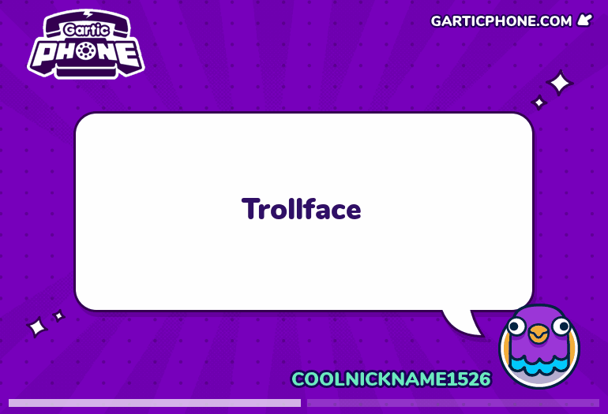
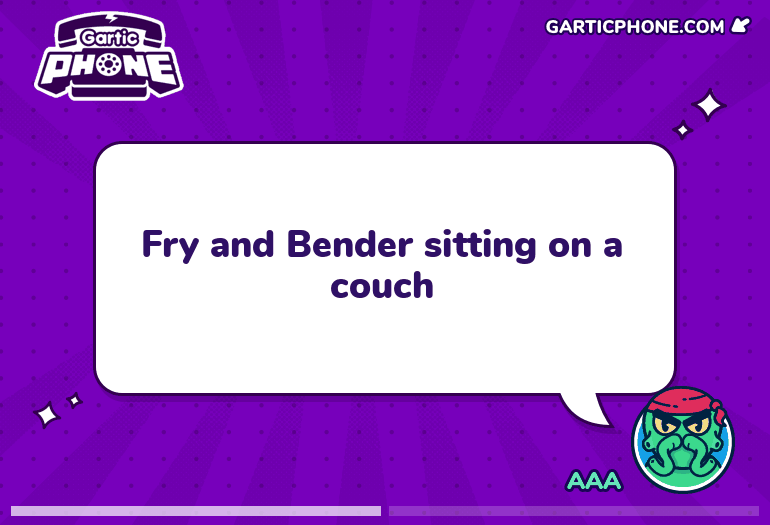

# Mouse G-Code Drawing Tool
This program will take any G-Code file and draw it via mouse movements on screen.
This will allow you to draw any shape/picture perfectly on screen.
I created this program mainly for online drawing games like skribbl.io or Garticphone.

## Examples
### Trollface

Took approximately 50sec to draw with the default settings

### Fry and Bender

**NOTE**: The random line through the middle is caused by Garticphone and is not visible in other drawing programs.
Took approximately 120sec to draw with the default settings

## Usage
First install the requirements (preferably in a python venv)

```shell
pip install -r requirements.txt
```
For evdev you might need to install the libpython-dev and python-dev packages for your operating system.

After that you can start the program
```shell
python3 main.py
```

The default button combos are:

<kbd>Ctrl</kbd> + <kbd>Alt</kbd> + <kbd>q</kbd> Start drawing

<kbd>Ctrl</kbd> + <kbd>Alt</kbd> + <kbd>w</kbd> Quit drawing

<kbd>Ctrl</kbd> + <kbd>Alt</kbd> + <kbd>x</kbd> Quit program


## Adjustable Settings
There are a few settings that you can adjust

| Constant      | Explanation                                                                                                                               | Default Value           |
|---------------|-------------------------------------------------------------------------------------------------------------------------------------------|-------------------------|
| DRAW_SCALE    | The scale of the drawing in relation to the G-Code                                                                                        | 4                       |
| X_OFFSET      | The x offset of the starting position  (drawing will start at mouse position with the given G-Codes, adjust according to your own G-Code) | 100                     |
| Y_OFFSET      | The y offset of the starting position (same as above)                                                                                     | 100                     |
| G_CODE_PATH   | The path to the G-Code file                                                                                                               | ./gcode/trollface.gcode |
| DRAW_INTERVAL | The interval between mouse movements in seconds (lower means faster drawing speeds but also might cause issues in certain drawing tools)  | 0.005                   |                                                                                                 | ./gcode/trollface.gcode |


## Obtaining new G-Code
Aside from downloading G-Code from the internet (look for CNC or laser cutting samples) 
you can create your own G-Code by taking any SVG file and using an SVG to STL tool to obtain the picture/shape 
you want to draw in form of a 3D object. You can then use 3D-Printing Slicer Software to calculate the necessary G-Code.

Alternatively you could use CNC software like JSCut to do this and skip the STL step (i.e. render SVG directly to G-Code) 
but I didn't test this yet. 